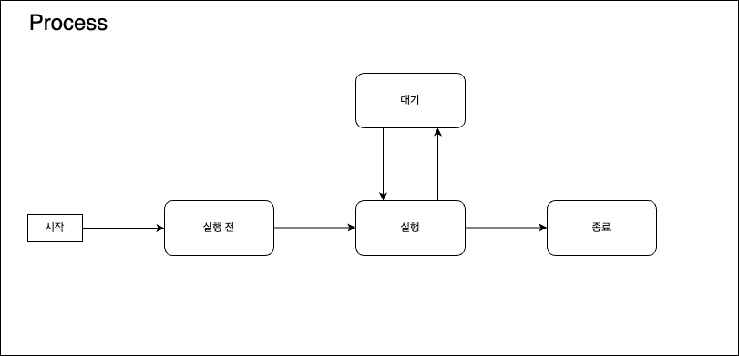

# Introduction
들어가기 전 용어의 혼동없이, 엄밀한 정의를 딛고 나아간다.

사실 다루는 내용들은 [The Art of Multiprocessor
Programming](https://cs.ipm.ac.ir/asoc2016/Resources/Theartofmulticore.pdf)를 크게 벗어나지 않는다.

궁금하면 위의 책을 참고삼아서 습득하는 걸 추천한다.

## 1. Process

흠.. 존재론적으로 비교를 해보자.

어떤 사물은 특정한 시점에 전체가 존재한다.

예를 들어 택배 상자는 그 존재 자체가 택배 도착시점에 택배상자 전체가 존재한다.

하지만 프로세스는 특정 시점에 일부만 존재한다.

택배 발송 프로세스는 특정한 시점에 그 과정의 일부만 존재한다.

프로세스를 어떤 과정에 대입할 수 있지만 우리는 컴퓨터과학을 다루기 때문에 계산 실행 주체로써 정의를 해보자.

프로세스는 계산을 실행하는 주체로써 4가지 상태전이로 이뤄진다.

그림과 같이 종료 전까지 항상 실행 상태가 아니라 대기 상태와 실행 상태를 넘나드는데, 보통 3가지 이유다.

1. 데이터 로딩
2. 리소스 대기
3. 자발적 대기

계산의 대상인 데이터를 기다리거나, 계산에 필요한 리소스를 확보하거나, 타이머 같이 자발적 대기로 전환할 수 있다.
자발적인 대기 상태는 장기적인 프로세스지만 현재에 아무것도 하지 않아서 대기 상태로 전환하는 것도 포함한다.

OS에서 이야기하는 process는 위의 process를 구현한 구현체로, [linux의 struct task_struct](https://github.com/torvalds/linux/blob/master/include/linux/sched/task.h)나 [windows의 struct EPROCESS](https://learn.microsoft.com/en-us/windows-hardware/drivers/kernel/eprocess#eprocess) 혹은 [MacOS(darwin)의 struct proc](https://opensource.apple.com/source/xnu/xnu-2422.1.72/bsd/sys/proc_internal.h) 같은 구조체로 정의된다.

실제를 알기 전엔 거대한 무언가 있을 것이라 생각해서 무척 허무할텐데... 진실은 항상 간단하고 명료한 법이다

## 2. Concurrency
